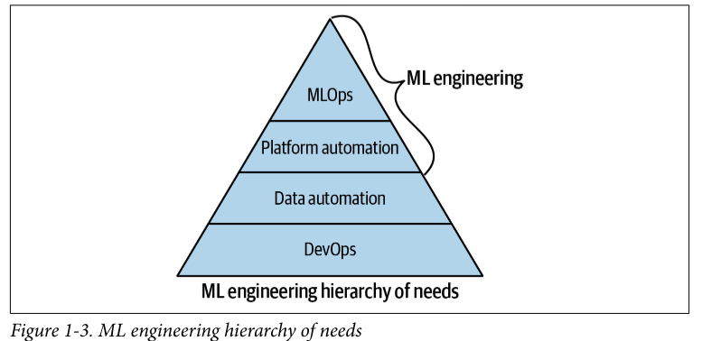

# Introduction to MLOps

Think of MLOps as the process of automating machine learning using DevOps methodologies.
```
If it is not automated, it's broken.
```
With MLOps, not only do the software engineering processes need full automation, but so do the data and modeling. The model training and deployment is a new wrinkle added to the traditional DevOps lifecycle. Finally, additional monitoring and instrumentation must account for new things that can break, like data drift - the delta between changes in the data from the last time the model training occurred.

**Machine Learning Engineering Certifications**
- Google has a Professional Machine Learning Engineer certification: It describes an ML engineer as someone who "designs, builds and productionizes ML models to solve business challenges.
- AWS describes an AWS Certified Machine Learning Specialist as someone with "the ability to design, implement, deploy, and maintain machine learning solutions for given business problems.

```
One way to look at data science versus machine learning engineering is to consider science versus engineering itself. Science gears toward research, and engineering gears toward production.
```

**Simple options for measuring the success of a machine learning engineering initiative at an organization**
- First, you could count hte machine learning models that go into production.
- Second, you could measure the impact of the ML models on business ROI.

These metrics culminate it are signals that predict a machine learning engineering project's success or failure.

**Partial List Of Tools And Processes Used in ML Engineering**

Advanced technology organizations know they need to leverage methodologies and tools that decrease the risk of machine learning projects failing. Partial list of tools and processes used in ml engineering:
- Cloud native ML platforms: AWS SageMaker, Azure ML Studio, and GCP AI Platform
- Containerized workflows: Docker format containers, Kubernetes, and private and public container registries
- Serveless technology: AWS Lambda, AWS Athena, Google Cloud Functions, Azure Functions
- Specialized hardware for machine learning: GPUs, Google TPU (TensorFlow Processing Unit), Apply A14, AWS Inferentia Elastic inference
- Big data platforms and tools: Databricks, Hadoop/Spark, Snowflake, Amazon EMR (Elastic Map Reduce), Google Big Query


**MLOps Hierarchy Of Needs**

An ML system is a software system, and software systems work efficiently and reliably when DevOps and data engineering best practices are in place. So how could it be possible to deliver the true potential of machine learning to an organization if DevOps basic foundational rules don't exist or data engineering is not fully automated?



One of the major things back machine learning projects is this necessary foundation of DevOps. After this foundation is complete, next is data automation, then platform automation, and then finally true ML automation, or MLOps, occurs. The culmination of MLOps is a machine learning sustem that works. The people that work on operationalizing and build machine learning applications are machine learning engineers and/or data engineers.

**DevOps** is a set of technical and management practices that aim to increase an organization's velocity in releasing high-quality software. Some of the benefits of DevOps include speed, reliability, scale, and security. These benefits occur throught adherence to the following best practices:
- **Countinous Integration (CI)**: Is the process of continuously testing a software project and improving the quality based on these test's results. It is automated testing using open source and SaaS build servers such as GitHub Actions, Jenkins, Gitlab, CircleCI, or cloud native build systems like AWS Code Build.
- **Continuous Delivery (CD)**: This method delivers code to a new environment without humam intervention. CD is the process of deploying code automatically, often through the use of ```IaC```.
- **Microservices**: Is a software service with a distinct function that had little to no dependencies. One of the most popular Python-based microservice frameworks is ```Flask```. For example, a machine learning prediction endpoint is an excellent fit for a microservice. Microservices using FaaS (function as a service, i.g. AWS Function) or microservice could be container-ready and use CaaS (container as a service) to deploy a Flask application with a Dockerfile to a service like AWS Fargate, Google Cloud Run, or Azure App Services.
- **Infrastructure as Code**: Is the process of checking the infraestructure into a source code repository and "deploying" it to push changes to that repository. Popular techologies include cloud-specific IaC like AWS Cloud Formation or AWS SAM (Serverless Application Model). Multicloud options include ```Pulumi``` or ```Terraform```.
- **Monitoring and instrumentation**: Are the processes and techniques used that allow an organization to make decisions about a software system's performance and reliability. Through logging and other tools like application performance monitoring tools such as New Relic, Data Dog, or Stackdriver, monitoring and instrumentation are essentially collecting data about the behavior of an application in production or data science for deployed software systems. ```This process is where Kaizen comes into play; the data-driven organization uses this instrumentation to make things better daily or weekly.```
- **Effective technical communication**: This skill involves the ability to create effective, repeatable, and efficient communication methods. An excellent example of effective technical communication could be adopting AutoML for the initial prototyping of a system (Of course, ultimately, the AutoML model may be kept or discarded). Automation can serve as an informational tool to prevent work on an intractable problem.
- **Effective technical project management**: This process can efficiently use humam and techology solutions to manage projects. Also, appropriate technical project management requires ```breaking down problems into small, discreet chunks of work, so incremental progress occurs```. Smaller wins delivered daily or weekly is more scalable and prudent approach to model building.